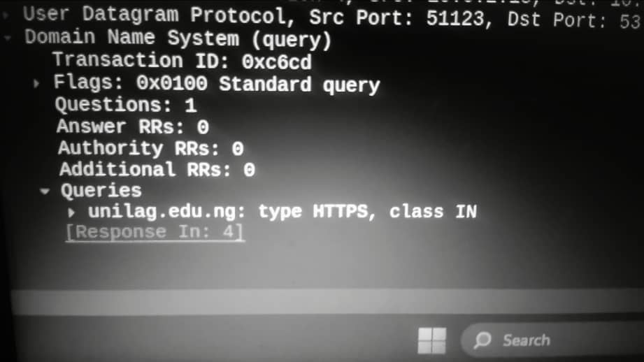
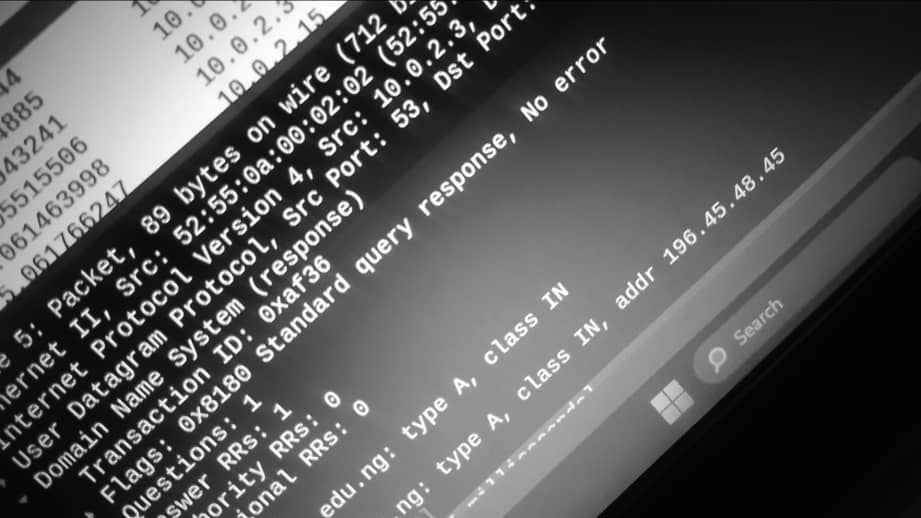
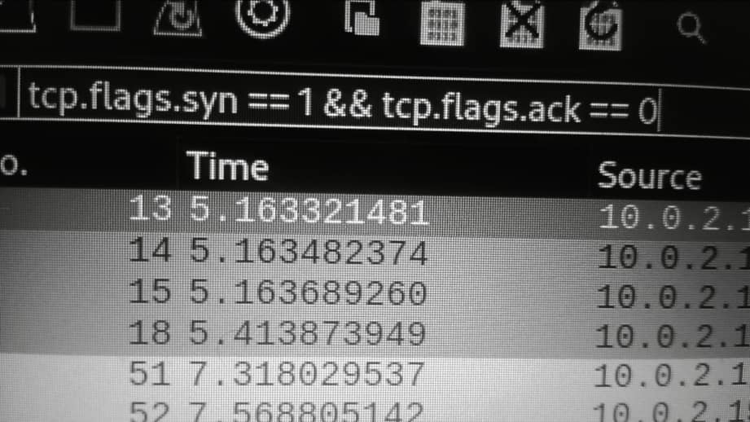
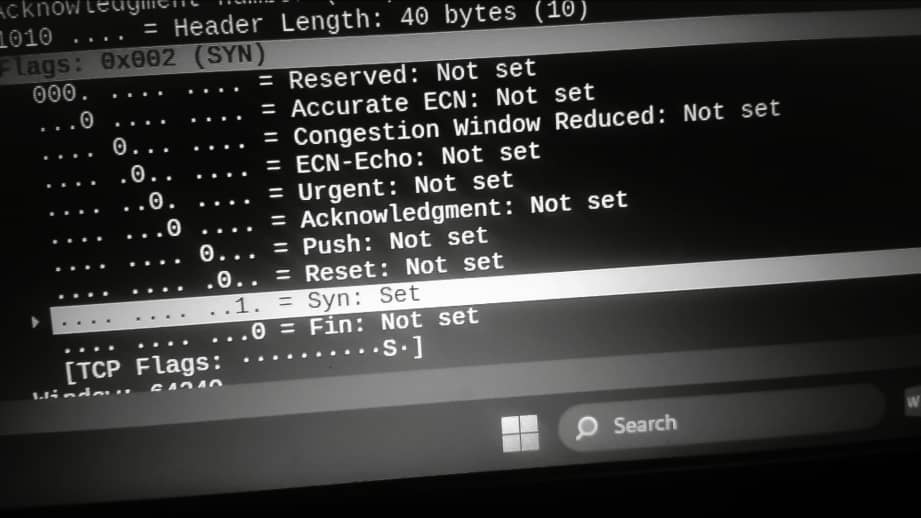
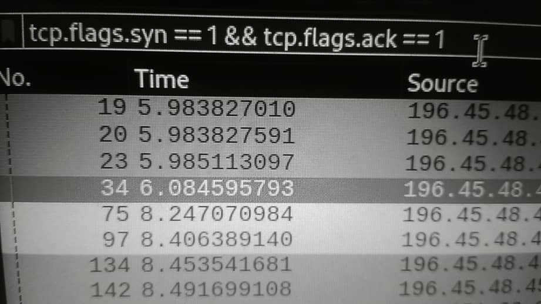
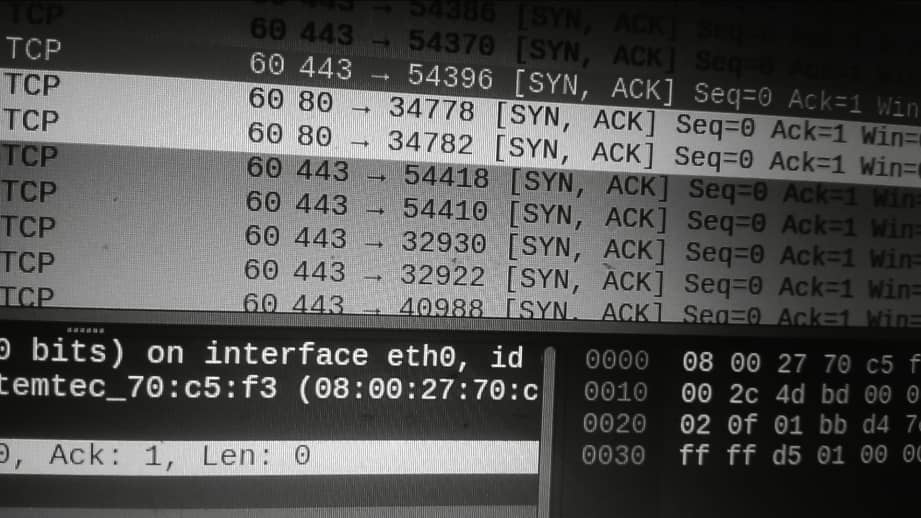
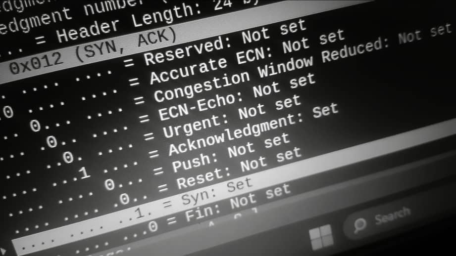
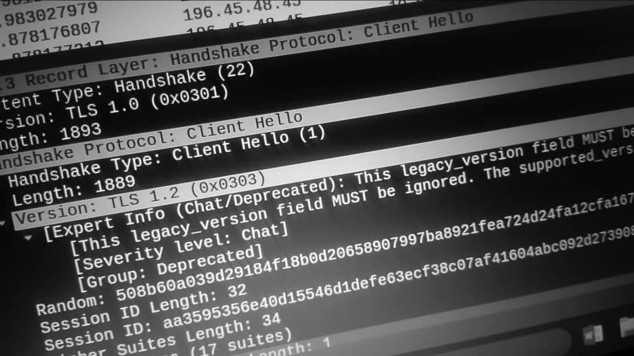
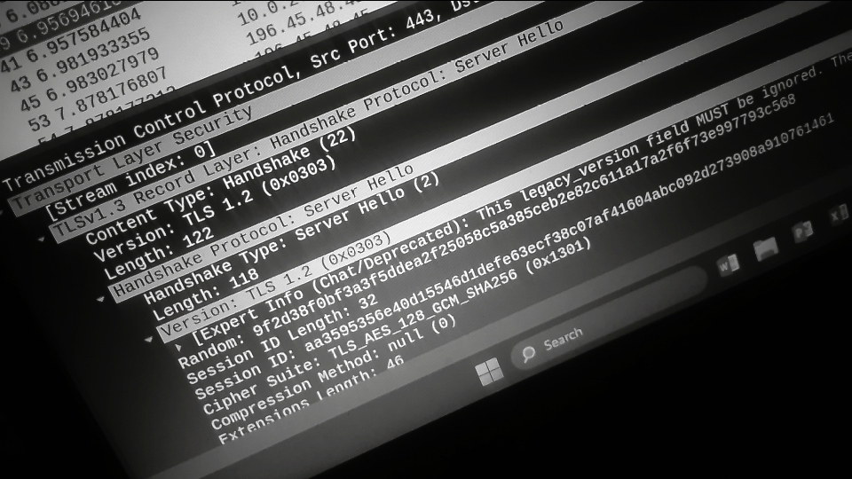
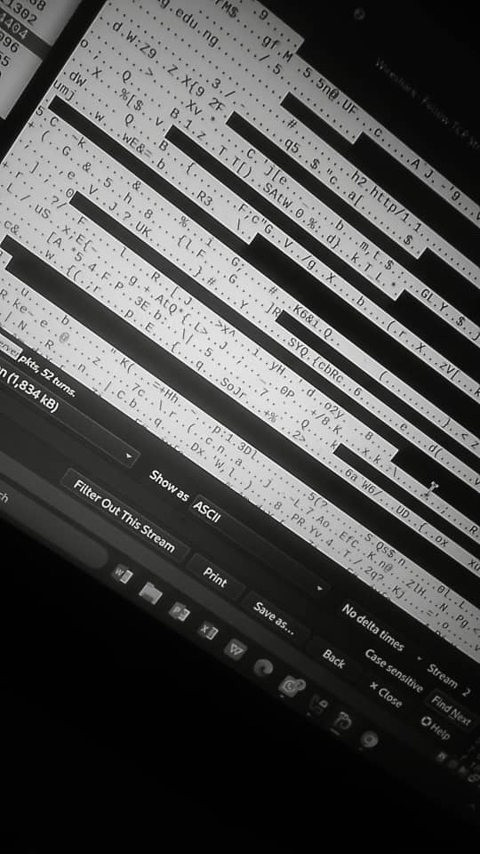

# Wireshark Traffic Analysis – UNILAG Website

## Project Overview

This project demonstrates the use of Wireshark to capture and analyze network traffic generated while accessing the University Of Lagos (UNILAG) website.

The objective was to understand the sequence of events that occur when a user visits a website, from domain name resolution to encrypted communication over HTTPS.

Through this analysis, I identified and examined DNS requests, the TCP 3-Way Handshake, the TLS Handshake, and HTTPS traffic.

---

## Objectives

- Capture network traffic using Wireshark.
- Analyze DNS queries and responses.
- Identify the TCP 3-Way Handshake.
- Examine the TLS Handshake process.
- Observe encrypted HTTPS communication.
- Practice using Wireshark display filters.
- Document findings in a structured report.

---

## Tools Used

- Wireshark
- Kali Linux
- Firefox
- UNILAG Website (unilag.edu.ng)

---

## Methodology

### Step 1: Traffic Capture

Wireshark was launched on the active network interface.

A web browser session was opened and the LASU website was accessed while packet capture was running.

After the website loaded successfully, the packet capture was stopped and saved for analysis.

---

### Step 2: DNS Analysis

Display Filter:

```wireshark
dns
```

The DNS query was used to identify how the browser resolved the domain name into an IP address.

The client sent a DNS request asking for the IP address associated with the LASU domain.

The DNS server responded with the corresponding IP address, allowing the browser to establish communication with the web server.

### Dns Query Image



### Dns Response Image



---

### Step 3: TCP 3-Way Handshake Analysis

Display Filters:

```wireshark
tcp.flags.syn == 1 && tcp.flags.ack == 0
```

```wireshark
tcp.flags.syn == 1 && tcp.flags.ack == 1
```

The TCP handshake was identified through the following sequence:

1. SYN packet from the client to the server.
2. SYN-ACK packet from the server to the client.
3. ACK packet from the client to the server.

This process established a reliable TCP connection before any application data was exchanged.

### SYN filter command



### SYN Output



### SYN,ACK filter command


### SYN, ACK packet display


### SYN,ACK Output


---

### Step 4: TLS Handshake Analysis

Display Filter:

```wireshark
tls
```

The TLS handshake was analyzed to understand how encryption was established between the browser and the web server.

Key observations included:

- Client Hello
- Server Hello
- Certificate Exchange
- Cipher Suite Negotiation
- Secure Session Establishment

The handshake ensured that communication between the client and server would be encrypted.

### Tls Client Hello



### Tls Server Hello


---

### Step 5: HTTPS Traffic Analysis

Display Filter:

```wireshark
tcp.port == 443
```

After the TLS handshake completed successfully, encrypted HTTPS traffic was observed.

The packet contents could not be viewed directly because the communication was protected using TLS encryption.

This demonstrated how HTTPS secures web traffic and protects sensitive information from interception.

### Https Encrypted Traffic



---

## Findings

### DNS Resolution

The domain name was successfully resolved to an IP address through DNS communication.

### TCP Connection Establishment

The TCP 3-Way Handshake successfully established a reliable connection between the client and server.

### TLS Encryption

The TLS Handshake negotiated secure communication parameters and established an encrypted session.

### Secure Data Transfer

HTTPS traffic was observed after TLS negotiation, confirming that web traffic was encrypted during transmission.

---

## Wireshark Filters Used

| Purpose | Filter |
|----------|----------|
| DNS Traffic | `dns` |
| SYN Packet | `tcp.flags.syn == 1 && tcp.flags.ack == 0` |
| SYN-ACK Packet | `tcp.flags.syn == 1 && tcp.flags.ack == 1` |
| TLS Traffic | `tls` |
| HTTPS Traffic | `tcp.port == 443` |

---

## Key Lessons Learned

- DNS translates domain names into IP addresses.
- TCP uses a 3-Way Handshake to establish reliable communication.
- TLS provides encryption and authentication.
- HTTPS protects web traffic from unauthorized access.
- Wireshark filters make network analysis more efficient.
- Understanding network fundamentals is essential for SOC Analyst roles.

---

## Conclusion

This project provided hands-on experience with packet analysis and helped build a deeper understanding of how web communication works.

By analyzing DNS requests, TCP connections, TLS negotiation, and HTTPS traffic, I gained practical experience with core networking concepts that are frequently used in Security Operations Center (SOC) environments.

This project serves as part of my cybersecurity portfolio and demonstrates foundational skills in network traffic analysis using Wireshark.


## Skills Demonstrated

- Network Traffic Analysis
- Packet Inspection
- DNS Analysis
- TCP/IP Fundamentals
- TLS/HTTPS Analysis
- Wireshark
- Cybersecurity Documentation
  
